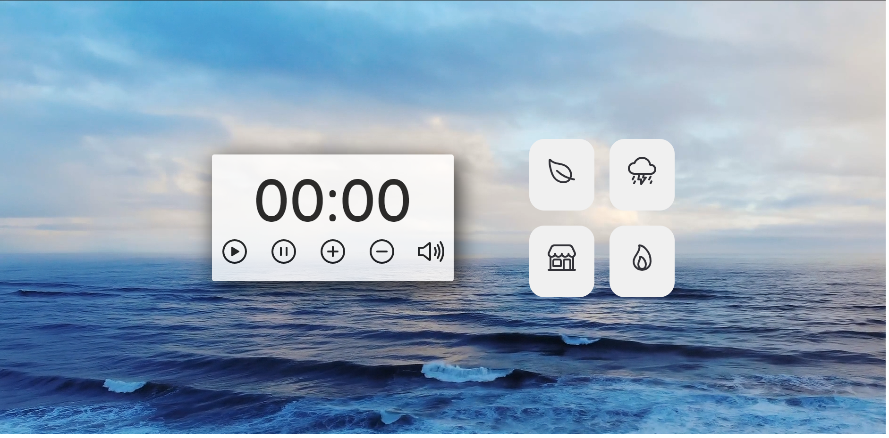
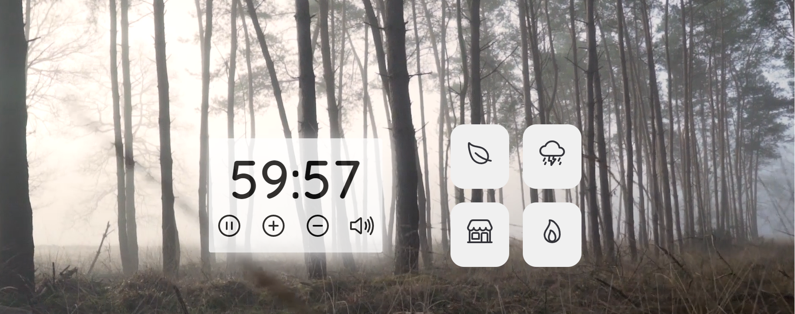
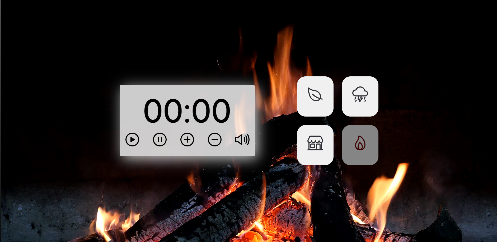
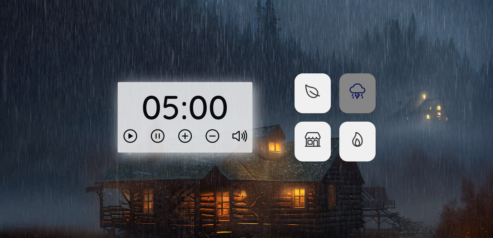
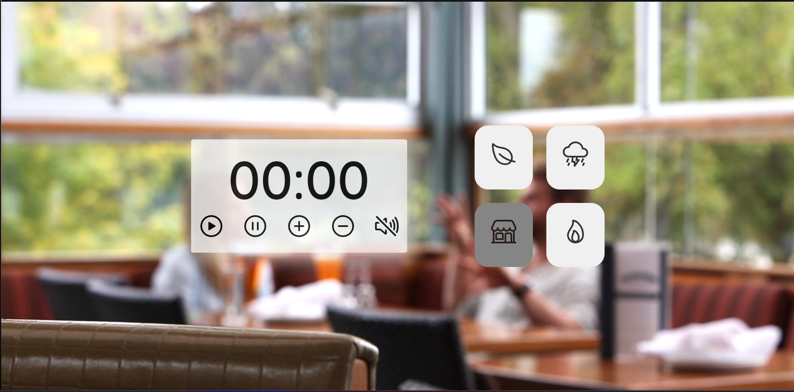

<h1 align="center"> Time to Focus and Chill</h1>

Its a web aplication that help you to study, focus, relax, do timed activies  

  <a href="#-tecnologias">Techs/Tecnologias</a>&nbsp;&nbsp;&nbsp;|&nbsp;&nbsp;&nbsp;
  <a href="#-projeto">Project/Projeto</a>&nbsp;&nbsp;&nbsp;|&nbsp;&nbsp;&nbsp;
  <a href="#-layout">Layout</a>&nbsp;&nbsp;&nbsp;|&nbsp;&nbsp;&nbsp;
  <a href="#memo-licença">License/Licença</a>

<video src="./src/assets/TimetoFocus.mp4" autoplay loop muted> </video>

  

  

  

  

  

## 🚀 Techs / Tecnologias

Esse projeto foi desenvolvido com as seguintes tecnologias:

- JavaScript
- HTML e CSS
- Git e Github

## 💻 Project / Projeto

Uma aplicação que permite o usuário selecionar o tempo de 5 à 60 minutos e então o timer inicia. O usuário pode pausar o timer em qualquer momento, acrescentar mais tempo ou diminuir o tempo. A aplicação também conta com temas: padrão, natureza, chuva, fogueira e cafeteria. Cada tema tem seu plano de fundo e sua música personalizada, o usuário pode escolher também o tema padrão com ou sem música.

An application that allows the user to select the time from 5 to 60 minutes and then the timer starts. The user can pause the timer at any time, add more time or decrease the time. The application also has themes: pattern, nature, rain, bonfire and coffee shop. Each theme has its own background and personalized music, the user can also choose the default theme with or without music.

## 🔖 Layout

Você pode visualizar o layout do projeto através do repositório e do deploy. 
